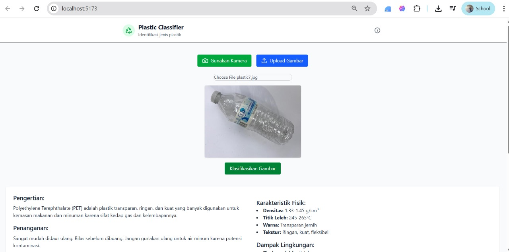
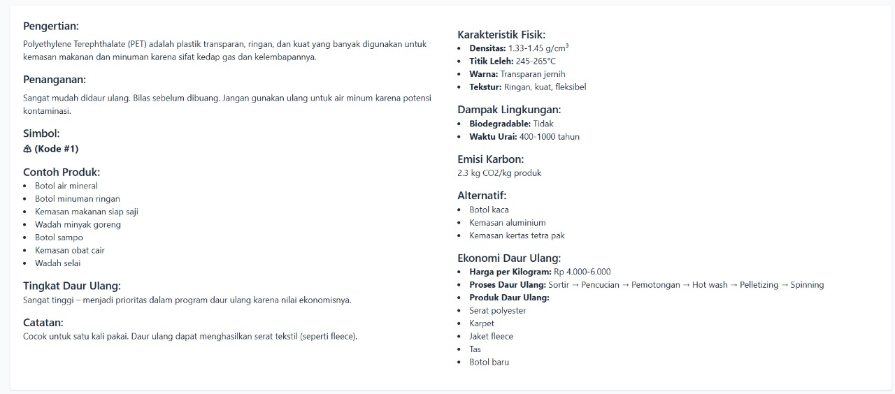
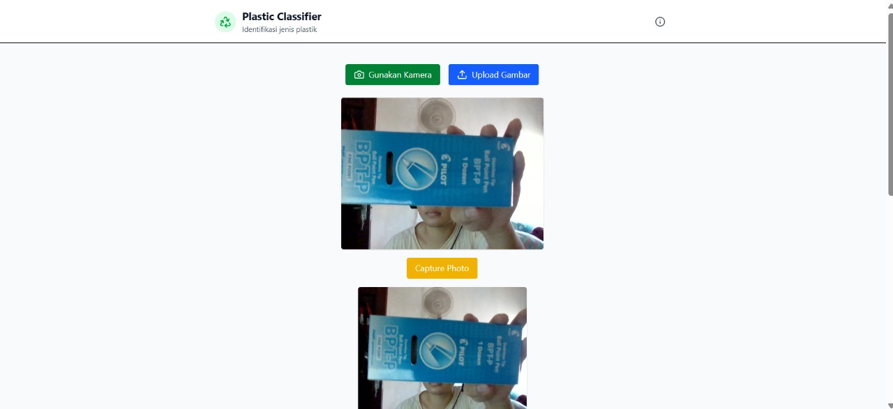

# ♻️ Plastic Classifier — Capstone Project

A smart, camera-based plastic classification app to help users identify different types of plastics (PET, HDPE, PP, PS) and provide educational insights to improve recycling habits. Built with computer vision and a modern frontend.

 <!-- Opsional: tambahkan screenshot UI -->
 <!-- Opsional: tambahkan screenshot UI -->
 <!-- Opsional: tambahkan screenshot UI -->

---

## 🚀 Features

- 🔍 **Real-time camera classification** using your device
- 🧠 Powered by **EfficientNetB7** and **YOLOv8** model trained on plastic images
- 📚 Educational info for each type of plastic
- 📱 Mobile-friendly interface (PWA-ready)
- ⚡ Fast and lightweight frontend with React
- ☁️ API-ready backend for model inference (TensorFlow/Keras)

---

## 🧩 Tech Stack

### Frontend
- React.js + Vite
- Tailwind CSS
- Vercel with Teachable Machine (If u want to try Sample of the App)

### Backend
- Python 3.10
- TensorFlow / Keras
- FastAPI 

---

## ⚙️ Getting Started

### 1. Clone this repo

```bash
git clone https://github.com/username/project-capstone.git
cd project-capstone
```
### 2. Set Up Frontend

```bash
cd /Frontend
npm install
npm run dev
```
Frontend akan berjalan sesuai dengan Port yang telah disesuaikan

### 3. Set Up Backend

```bash
cd /Backend
pip install requirement.txt
uvicorn useyolo:app --reload #Jika ingin menggunakan Yolov8 sebagai model ML
uvicorn main:app --reload #Jika ingin menggunakan EfficientNetb7 sebagai model ML
```

## 🧪 Demo

### 📷 Try classifying plastic types directly from your webcam!

#### Watch this Demonstration To Use Our Machine Learning

#### Click This Link to Use our Demo with Teachable Machine as a sample
https://image-classifier-1912.vercel.app/

## 📚 Educational Reference
Each plastic type (PET, HDPE, PP, PS) comes with:

🔁 Recyclability information

♻️ Disposal recommendations

🌍 Environmental impact

## 🙋‍♂️ About This Project
This is a capstone project built as part of my journey to explore practical applications of machine learning and human-centered design for sustainability. The goal is to encourage more responsible plastic disposal through intuitive tech.